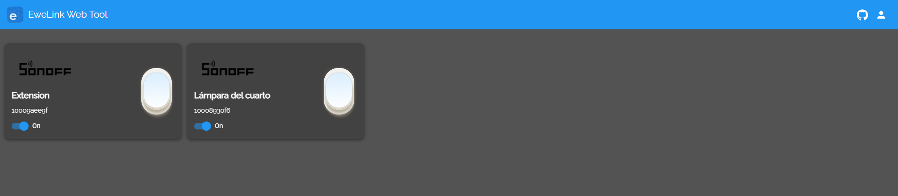

# Ewelink Web App

<a href="https://simpleanalytics.com/?utm_source=ewelink-web.vercel.app&utm_content=badge" referrerpolicy="origin" target="_blank"></a>

I am pleased to show you a web tool for ewelink.



# Privacy

The only use that we give to the credentials (email / password) is to obtain access from __ewelink__

```js
const { email, password } = req.body;

const connection = new ewelink({
  email,
  password,
});

const data = await connection.getCredentials();
```
<sub><sup>
( email / password are data for 1 use only, they are not stored for anything )
</sup></sub>

This is what the access data for the Ewelink account and devices looks like

```JSON
{
  "at": "*************",
  "rt": "*************",
  "user": {
    "clientInfo": {
      "model": "iPhone 11 Pro_iPhone12,3",
      "os": "iOS",
      "imei": "*************",
      "romVersion": "14.3",
      "appVersion": "4.8.1"
    },
    "_id": "*************",
    "email": "usertest@gmail.com",
    "password": "*************",
    "appId": "*************",
    "isAccepEmailAd": false,
    "createdAt": "2019-08-01T22:25:08.703Z",
    "apikey": "*************",
    "__v": 0,
    "lang": "en",
    "online": false,
    "onlineTime": "2021-01-10T23:15:14.852Z",
    "appInfos": [
      { "os": "ios", "appVersion": "" },
      { "os": "android", "appVersion": "4.6.0" }
    ],
    "ip": "179.13.51.15",
    "location": "",
    "offlineTime": "2021-01-10T23:16:21.459Z",
    "bindInfos": { "gaction": ["ewelink-google-home-v1", "ewelinkGoogleHome"] },
    "userStatus": "2",
    "nickname": "usertest",
    "countryCode": "+86",
    "currentFamilyId": "*************",
    "language": "en",
    "extra": { "ipCountry": "CO" }
  },
  "region": "us"
}

```

Once the access JSON is obtained, we use the data obtained `at`,` region`, etc...

```js
const connection = new ewelink({
  at,
  region,
});
```

**References**:

> [eWelink API](https://ewelink-api.now.sh/docs/introduction)
