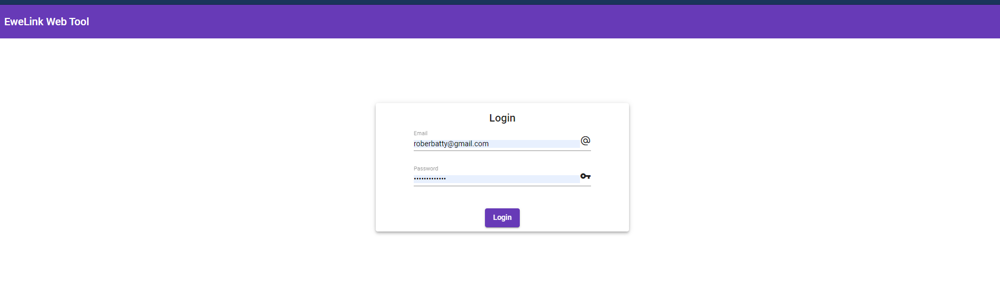

# Ewelink Web App





**Documentación**:

[EweLink-API](https://ewelink-api.now.sh/docs/introduction)


1. socket timer example

````json
{
 "action": "update",
 "deviceid": "10009aee9f",
 "apikey": "6613294f-2a51-4c0c-9a88-9c5329959d82",
 "userAgent": "app",
 "sequence": "1578951872889",
 "ts": 0,
 "params": {
  "timers": [
   {
    "enabled": 1,
    "coolkit_timer_type": "repeat",
    "at": "0 7 * * 1,2,3,4,5,6,0",
    "type": "repeat",
    "do": {
     "switch": "off"
    },
    "mId": "a6cdac3a-ab18-caeb-73f1-28f805f13d05"
   },
   {
    "enabled": 1,
    "coolkit_timer_type": "delay",
    "at": "2020-01-13T23:37:00.171Z",
    "period": "120",
    "type": "once",
    "do": {
     "switch": "off"
    },
    "mId": "e7f8d26f-f44a-f5e1-f8b6-d152880d80d6"
   }
  ]
 },
 "tempRec": "10009aee9f"
}

````
